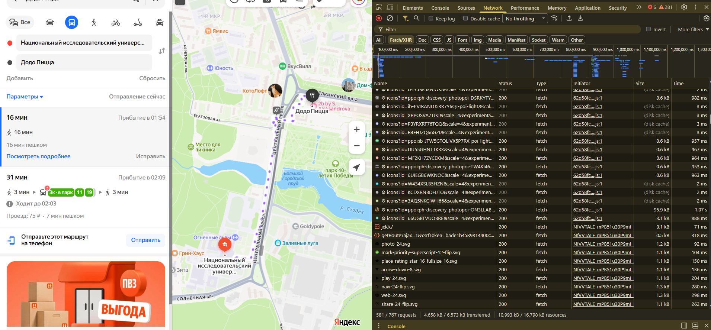
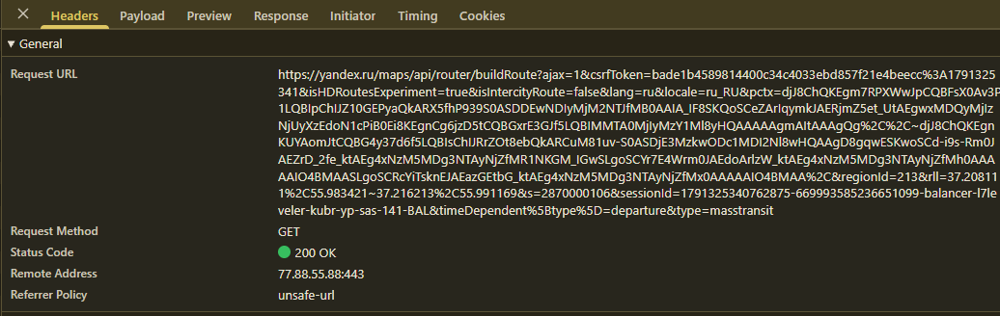
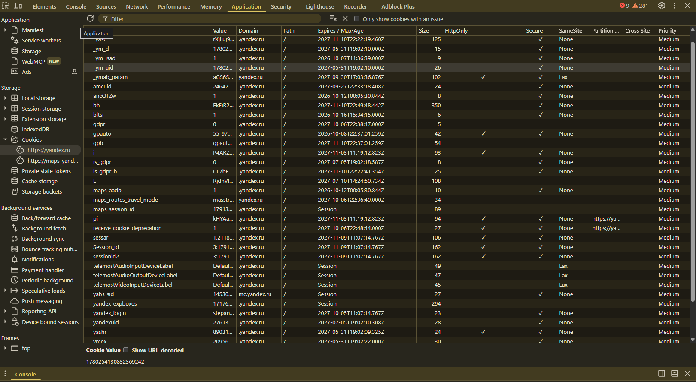
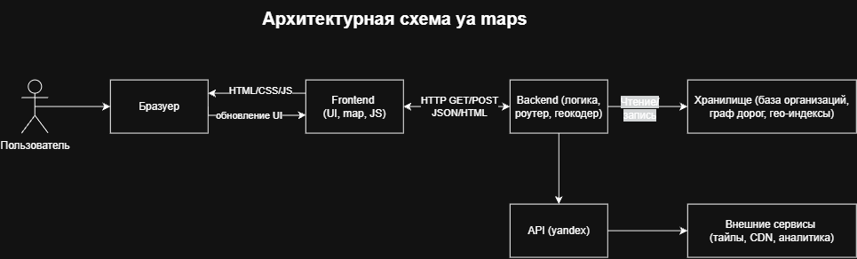
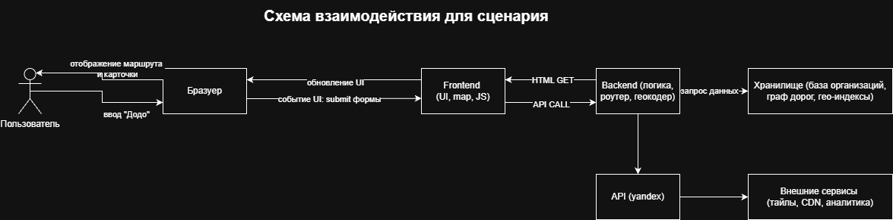

# Лабораторная работа №2
## Анализ веб-приложения и клиент-серверного взаимодействия

## 1. Исследуемая информационная система

Для выполнения лабораторной работы используется геоинформационный сервис **Яндекс Карты** и пользовательский сценарий: **поиск организации и построение оптимального автомобильного маршрута**.

Яндекс Карты представляет собой высоконагруженное Single Page Application (SPA), работающее вокруг динамического картографического движка. Пользователь взаимодействует с интерактивным интерфейсом, который асинхронно обменивается данными с серверной частью через специализированные API-сервисы. Это позволяет искать объекты, прокладывать маршруты и получать информацию без перезагрузки всей страницы.

В ходе исследования выделены следующие ключевые компоненты системы:
- **Браузер пользователя:** среда исполнения клиентского кода и рендеринга карты.
- **Интерфейс сервиса (Frontend):** визуальные компоненты, панели поиска и карточки объектов.
- **Клиентский JavaScript (Ядро карт):** перехватывает действия пользователя, управляет WebGL-контекстом карты и инициирует сетевые запросы.
- **API-сервисы Яндекса:** шлюзы, принимающие запросы на поиск, геокодирование и маршрутизацию.
- **Backend-сервисы:** распределенная серверная система обработки пространственных данных и графов дорог.
- **Хранилища данных:** базы данных организаций, гео-индексы и графы дорожной сети.
- **Внешние и специализированные сервисы:** CDN для доставки статики, тайловые серверы и системы веб-аналитики.

### 1.1. Сценарий исследования
1. Открытие главной страницы Яндекс Карт.
2. Ввод в поисковую строку целевого запроса (например, «Додо Пицца»).
3. Выбор организации из списка результатов и открытие её карточки.
4. Нажатие кнопки «Маршрут» в карточке организации.
5. Выбор автомобильного режима передвижения.
6. Ввод точки отправления и генерация оптимального пути.
7. Отображение проложенной нити маршрута на карте.

## 2. Анализ HTTP-запросов

Для изучения сетевого взаимодействия использовалась вкладка **Network** в инструментах разработчика DevTools. Перед началом выполнения сценария список запросов был полностью очищен. Это позволило изолировать системные вызовы, инициированные действиями пользователя.

### 2.2. Таблица HTTP-запросов

Ниже приведены ключевые сетевые запросы, зафиксированные в ходе выполнения сценария поиска «Додо Пицца» и построения пути. Сессионные токены, длинные массивы флагов и персональные CSRF-ключи в таблице сокращены для обеспечения безопасности данных.

| № | Метод | URL / тип запроса                                                                  | Статус | Назначение                                                      |
|---|-------|------------------------------------------------------------------------------------|--------|-----------------------------------------------------------------|
| 1 | GET   | `/maps/api/search?add_type=direct&ajax=1&csrfToken=bade1b...&text=Додо+Пицца`      | 200 OK | Полнотекстовый поиск организации и получение метаданных        |
| 2 | GET   | `https://core-renderer-tiles.maps.yandex.ru/vmap3/tiles?lang=ru_RU&x=4943&y=2558` | 200 OK | Загрузка векторных тайлов (плиток) подложки карты              |
| 3 | GET   | `https://yandex.ru`         | 200 OK | Синхронизация и загрузка истории поисков из облачного профиля  |
| 4 | GET   | `/maps/api/router/buildRoute?ajax=1&csrfToken=bade1b...&rll=37.18...~37.21...`     | 200 OK | Расчет оптимального автомобильного маршрута на графе дорог       |
| 5 | GET   | `/maps/api/taxi/getRoute?ajax=1&csrfToken=bade1b...&rll=37.18...~37.21...`         | 200 OK | Запрос стоимости и времени поездки на такси для виджета цены    |

### 2.3. Запросы, относящиеся к пользовательскому сценарию

К выбранному сценарию напрямую относятся поисковый вызов API и запрос к модулю маршрутизации. После ввода текста «Додо Пицца» интерфейс формирует асинхронный поисковый запрос, а при активации режима «На автомобиле» отправляется специализированный запрос на вычисление траектории.

**Наблюдаемый факт:** Весь сценарий выполняется внутри одной страницы (SPA). При нажатии кнопок в DevTools фиксируются GET-запросы к `/maps/api/search` и `/maps/api/router/buildRoute`, которые возвращают структурированные данные без перезагрузки документа.

**Предположение:** Серверный шлюз принимает параметры маршрутизации и делегирует расчет специализированному микросервису (роутеру), который работает с динамической матрицей пробок в реальном времени.

Вкладка Network в процессе фиксации сетевой активности представлена на скриншоте ниже.




## 3. Анализ HTTP-ответов

Для детального анализа были выбраны два ключевых ответа сервера, обеспечивающих работоспособность сценария на стороне клиента.

### 3.1. Пример анализа ответа на запрос поиска организации
Для API-запроса `/maps/api/search` возвращается успешный статус-код **200 OK**. 

Основные наблюдаемые заголовки ответа:
- `Content-Type: application/json; charset=utf-8` — указывает на передачу структурированного текстового документа в кодировке UTF-8.
- `Referrer Policy: unsafe-url` — политика передачи адреса источника запроса.

Тело ответа представляет собой сложный JSON-массив, содержащий географические координаты найденных филиалов «Додо Пицца», их точные адреса, телефоны, графики работы и рейтинги. Клиентский JavaScript обрабатывает этот JSON, строит список на боковой панели и генерирует маркеры (POI) на карте.

### 3.2. Пример анализа ответа на запрос построения маршрута
Запрос к роутинговому API `/maps/api/router/buildRoute` возвращает статус **200 OK**. Данный ответ содержит массив гео-точек (широта и долгота), образующих ломаную линию пути.

Примерная JSON-структура ответа роутера:
```json
{
  "status": "success",
  "data": {
    "routes": [
      {
        "distance": {"value": 5400, "text": "5.4 км"},
        "duration": {"value": 960, "text": "16 мин"},
        "durationInTraffic": {"value": 960, "text": "16 min"},
        "geometry": {
          "coordinates": [
            [37.187406, 55.976178],
            [37.191200, 55.981000],
            [37.216213, 55.991169]
          ]
        }
      }
    ]
  }
}
```
Клиентская часть принимает этот массив координат и с помощью графической библиотеки WebGL отрисовывает фиолетовую нить автомобильного пути поверх интерактивной карты.

**Наблюдаемый факт:** В ответе сервера содержатся точные данные о расстоянии и времени в пути, которые мгновенно транслируются на левую панель интерфейса (отображается «16 мин» и «31 мин» для альтернативного пути).


## 4. Анализ параметров и передаваемых данных

### 4.1. Параметры поискового запроса и построения пути
При взаимодействии с картами клиент передает серверу набор query-параметров в строке URL (Query String parameters):

- `ajax=1` — флаг, указывающий, что запрос является асинхронным (XHR/Fetch).
- `csrfToken=bade1b45...` — уникальный защитный токен для предотвращения межсайтовой подделки запроса.
- `rll=37.187406%2C55.976178~37.216213%2C55.991169` — критически важный параметр, содержащий закодированные пары координат `[Долгота, Широта]` для Точки А (старт) и Точки Б (финиш «Додо Пицца»), разделенные символом тильды `~`.
- `lang=ru_RU` — параметр локализации для возврата текстовых подсказок на русском языке.

### 4.2. Расположение данных и механизм обмена
Все параметры в исследуемом сценарии передаются методом **GET** непосредственно внутри строки запроса URL. Тело запроса (Payload) остается пустым, так как GET-запросы по стандарту HTTP не содержат вложенного тела. Служебные идентификаторы сессии передаются в заголовках и через `Cookie`.

В ответ сервер возвращает готовые JSON-данные. Таким образом, обмен происходит по схеме: **Клиент (URL-параметры) -> Сервер -> Клиент (JSON-модель)**.

### 4.3. Какие данные передаются при построении маршрута

При построении автомобильного маршрута в Яндекс Картах сервер получает следующие данные:

- координаты точки отправления (Точка А) и точки назначения (Точка Б) в формате `[долгота, широта]`, разделённые символом `~` в параметре `rll`;
- флаг асинхронного запроса `ajax=1`;
- CSRF-токен для защиты от межсайтовой подделки запроса;
- параметр локализации `lang=ru_RU`;
- выбранный режим передвижения (автомобиль), который может передаваться неявно через тип запроса или дополнительный параметр.

В ответ сервер возвращает JSON-объект, содержащий массив координат ломаной линии маршрута, расстояние в метрах, время в пути в секундах и другие метаданные. Клиентская часть использует эти данные для отрисовки нити маршрута на карте и отображения информации на панели.



## 5. Анализ cookies

Cookies используются в веб-приложении Яндекс Карты для сохранения состояния сессии пользователя, его персональных настроек интерфейса, авторизации в экосистеме Яндекса (Яндекс ID) и сбора продуктовой аналитики.

### 5.1. Что было обнаружено

Для исследуемого сайта были просмотрены активные cookies через вкладку **Application -> Storage -> Cookies -> https://yandex.ru**. Реальные конфиденциальные значения из соображений безопасности скрыты, а ключевые технические параметры сведены в таблицу ниже:

| Имя cookie | Домен | Срок действия | Назначение | Флаги | Комментарий |
|---|---|---|---|---|---|
| `yandexuid` | `.yandex.ru` | Длительный | Уникальный идентификатор браузера пользователя | Secure | Наблюдаемый факт: используется для аналитики и привязки профиля |
| `Session_id` / `sessionid2` | `.yandex.ru` | Длительный | Хранение токена активной сессии авторизации | Secure, HttpOnly | Предположение: обеспечивает доступ к «Моим местам» и закладкам |
| `yandex_login` | `.yandex.ru` | Длительный | Хранение имени авторизованного аккаунта пользователя | Secure | Наблюдаемый факт: отображает имя текущего профиля в системе |
| `maps_routes_travel_mode` | `.yandex.ru` | Длительный | Сохранение выбранного пользователем типа транспорта | Secure | Наблюдаемый факт: кука хранит пресет (автомобиль/пешком) между сессиями |
| `maps_session_id` | `.yandex.ru` | Сессия | Временный идентификатор текущей карты в рамках SPA | Secure | Наблюдаемый факт: кука удаляется при закрытии вкладки |
| `i` | `.yandex.ru` | Длительный | Служебный аналитический маркер Яндекса | Secure | Предположение: агрегация продуктовых метрик |

### 5.2. Анализ результатов

**Наблюдаемый факт:** Абсолютно все критически важные cookies Яндекса (такие как `sessionid`, `yandexuid`, `i`) используют флаг **Secure**. Это гарантирует, что браузер будет передавать их исключительно по зашифрованному протоколу HTTPS, защищая от перехвата трафика.

**Наблюдаемый факт:** Часть кук, отвечающих за авторизационные сессии, дополнительно снабжена флагом **HttpOnly**. Это закрывает к ним доступ со стороны клиентских JavaScript-сценариев, полностью защищая пользователя от кражи сессии через XSS-атаки.

Скриншот вкладки Application с зафиксированными файлами cookie представлен ниже.




## 6. Взаимодействие Frontend, API и Backend

Для пользовательского сценария «Поиск организации и построение автомобильного маршрута» цепочка событий представляет собой классический сквозной цикл Single Page Application.

### 6.1. Последовательность событий при построении маршрута

1. **Действие пользователя:** В карточке «Додо Пицца» пользователь кликает на иконку «На автомобиле» в верхней панели видов транспорта.
2. **Реакция интерфейса (Frontend):** Нажатый элемент меняет свой визуальный статус. Активируется CSS-класс `travel-modes-view__mode_auto_checked`, кнопка окрашивается в синий цвет, а иконка машины становится белой.
3. **Клиентская логика (JavaScript):** Скрипт ядра карт перехватывает клик, считывает текущую геопозицию пользователя (Точка А) и координатную метку «Додо Пицца» (Точка Б), после чего формирует URL-параметры.
4. **Отправка HTTP-запроса:** Браузер инициирует асинхронный GET-запрос к API маршрутизации по адресу `/maps/api/router/buildRoute?rll=ТочкаА~ТочкаБ&ajax=1`.
5. **Обработка на стороне API:** Шлюз Яндекса принимает запрос, проверяет валидность токена безопасности CSRF (`csrfToken`) и перенаправляет параметры на Backend-сервер.
6. **Вычисления на Backend:** Серверный микросервис накладывает координаты на масштабный цифровой граф дорог, обращается к динамической матрице пробок в реальном времени и рассчитывает несколько альтернативных ломаных линий пути.
7. **HTTP-ответ:** Сервер возвращает клиенту статус **200 OK** и JSON-пакет, содержащий массив географических точек траектории, расстояние в метрах и время в секундах.
8. **Обновление интерфейса:** Клиентский JavaScript принимает JSON, передает координаты в графический движок WebGL, который мгновенно рисует цветную нить маршрута поверх карты. На боковой панели текстовые блоки обновляются значениями «16 мин» и «5.4 км» без общей перезагрузки страницы.


## 7. Сопоставление с архитектурой из лабораторной работы №1

Проведенное во второй лабораторной работе исследование сетевых вызовов и структуры данных позволило сопоставить первоначальные теоретические гипотезы с реальными фактами работы системы.

### 7.1. Что удалось подтвердить фактами (DevTools)
- **Концепция SPA:** Подтверждена полностью. Вся работа от поиска до прокладки путей идет в рамках одного документа через асинхронные Fetch/XHR-запросы.
- **Роль API:** Обнаружены прямые обращения к `/maps/api/search` и `/maps/api/router/buildRoute`. API действительно выступает строгим структурированным мостом между интерфейсом и сервером.
- **Использование внешних доменов:** Напрямую зафиксирована потоковая загрузка слоев подложки карты с домена `core-renderer-tiles.maps.yandex.ru` через векторные тайлы.

### 7.2. Что остается на уровне предположений
- **Технологический стек Backend:** Мы видим только HTTP-ответы от сервера. На каком языке написана бизнес-логика роутера (C++, Go, Python) и какие конкретно СУБД (PostgreSQL, ClickHouse или кастомные NoSQL-решения Яндекса) хранят базу организаций — определить из браузера невозможно.
- **Алгоритмы маршрутизации:** Сервер отдает уже готовый массив точек. Сама логика работы алгоритмов поиска путей на графе (например, модификации алгоритма Дейкстры или A*) скрыта внутри серверной части.

### 7.3. Дополнение архитектурной схемы

По результатам исследования подтверждено, что взаимодействие компонентов при построении маршрута соответствует схеме: Пользователь → Браузер → Frontend → API → Backend → Хранилище данных, с использованием внешних сервисов для загрузки тайлов карты. На основе этого была обновлена архитектурная схема, построенная в лабораторной работе №1. Обновлённая схема представлена ниже.



## 8. Схема взаимодействия компонентов

На основе проведённого анализа была построена отдельная схема взаимодействия компонентов для выбранного пользовательского сценария: поиск организации «Додо Пицца» и построение автомобильного маршрута.

На схеме отражены:

- пользователь;
- браузер;
- frontend (интерфейс Яндекс Карт);
- API-сервисы Яндекса (поиск, маршрутизация);
- backend-сервисы (обработка пространственных данных, граф дорог);
- хранилища данных (база организаций, гео-индексы, граф дорожной сети);
- внешние сервисы (CDN, тайловые серверы);
- направления передачи данных;
- подписи стрелок: действие пользователя, HTTP GET, JSON, ответ сервера.

Схема сохранена в форматах .drawio и .png.



## 9. Вывод

В ходе лабораторной работы было проведено исследование HTTP-взаимодействия в веб-приложении Яндекс Карты на выбранном сценарии «поиск организации и построение автомобильного маршрута». Было установлено, что интерфейс работает как Single Page Application, обмениваясь данными с сервером через асинхронные HTTP-запросы без перезагрузки страницы.

Были выявлены следующие важные результаты:

- браузер и frontend тесно взаимодействуют для обработки действий пользователя;
- запросы к API выполняются при поиске организации и при построении маршрута;
- поиск сопровождается GET-запросом к `/maps/api/search`, а маршрутизация — GET-запросом к `/maps/api/router/buildRoute`;
- данные передаются в URL в виде query-параметров (координаты, токены, локализация);
- сервер возвращает JSON-ответы, содержащие структурированные данные (метаданные организаций, координаты маршрута, расстояние и время);
- cookies используются для хранения сессии, настроек интерфейса и аналитики, при этом критичные cookies защищены флагами Secure и HttpOnly.

Главный вывод состоит в том, что современное веб-приложение является распределённой системой: пользователь взаимодействует с UI, frontend формирует сетевые запросы, API организует обмен данными, а backend обрабатывает их и сохраняет состояние. Важным является также разделение фактов и предположений: факты подтверждены в DevTools, а предположения обозначены как гипотезы, поскольку без доступа к серверной части нельзя установить внутреннюю реализацию с абсолютной уверенностью.

### 9.1. Результаты работы

- Подтверждено: наличие HTTP-запросов при поиске и построении маршрута.
- Подтверждено: наличие API-взаимодействия между frontend и backend.
- Подтверждено: использование cookies и заголовков HTTP для поддержания сессии и передачи данных.
- Подтверждено: обновление интерфейса после получения ответа сервера.
- Предположительно: конкретная реализация backend и структура внутренних сервисов.

В результате лабораторная работа была оформлена в виде отчёта с описанием сетевого взаимодействия, таблицами запросов, анализом параметров и cookies, а также архитектурной схемой сценария.


